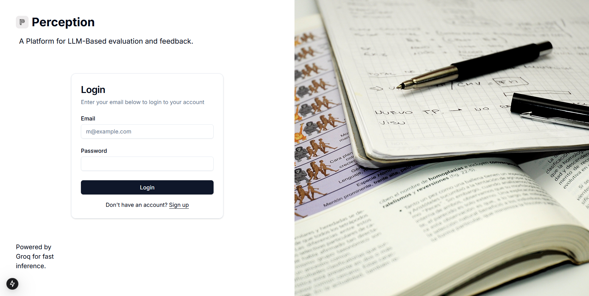
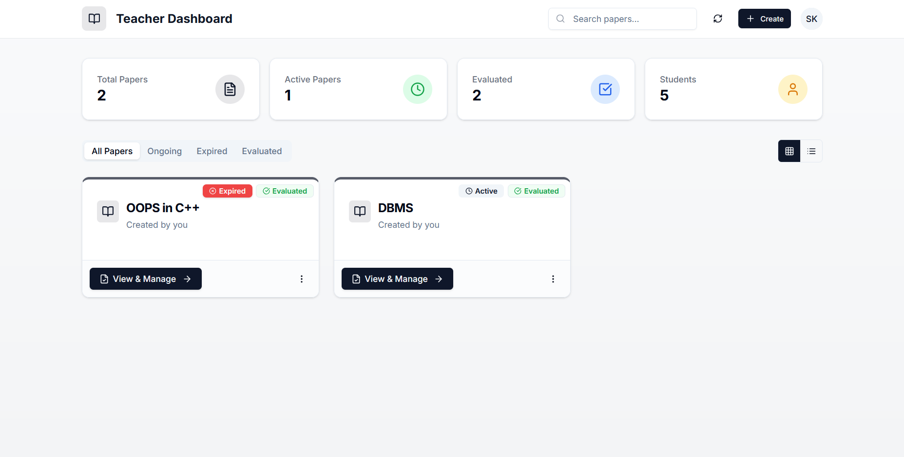
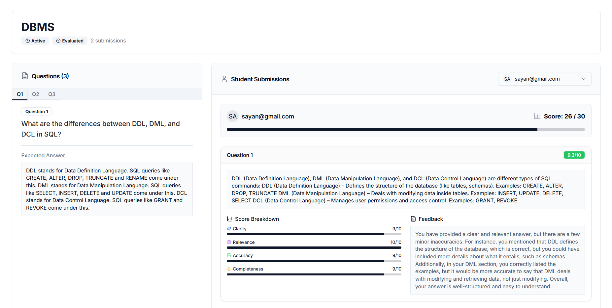
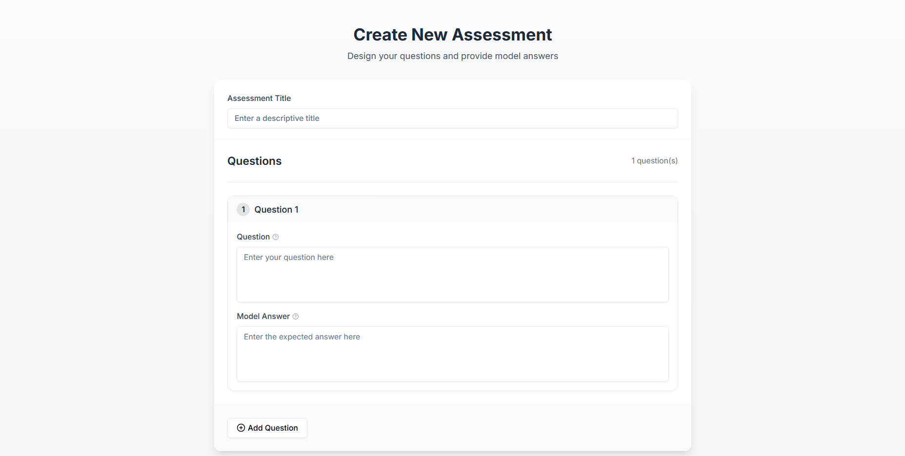
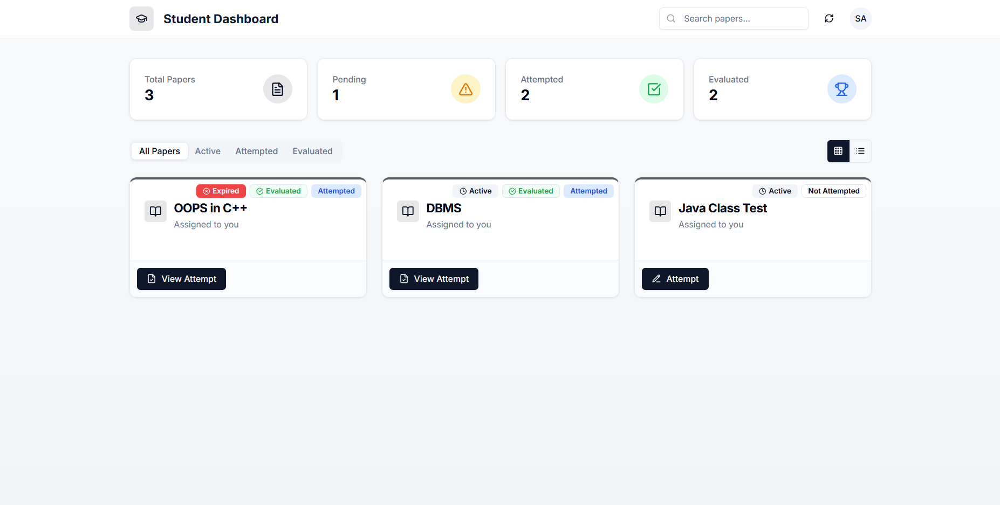
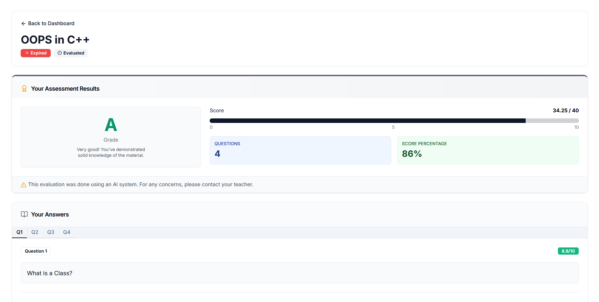

# Perception - AI-Powered Online Evaluation Portal

In today’s education landscape, **automated assessments** often fail to provide meaningful feedback for descriptive answers.
Even with the presence of AES (Automated Essay Grading), it works in open-world and hence, not Context specific, and does not provide any feedback.

**Perception** bridges this gap by leveraging **Contextual AI-powered evaluation**, ensuring that students receive **accurate, personalized, and constructive feedback**, just like a human evaluator.

## Features

### **For Students**

- View **pending** and **submitted** question sets of assigned teachers.
- Answer **descriptive** questions within the portal.
- Receive **AI-generated feedback and scores** after evaluation by teachers.

### **For Teachers**

- **Create** and **manage** question sets.
- Provide **model answers** and **rubric** to guide AI-based evaluation and obtain custom scores of students as evaluated by the LLM.
- **Review & finalize** AI-generated scores before submission.

### **AI-Based Evaluation**

- Uses **LLM** to **compare** student responses with teacher-provided answers.
- Provides **personalized feedback** and **suggestions** for improvement.
- Ensures **fair and unbiased** evaluation across all students by using pre-defined rules and rubric.

### Application Screenshots

|       Authentication       |           Teacher Dashboard            |
| :------------------------: | :------------------------------------: |
|  |  |

|        Question Management        |            Question Creation            |
| :-------------------------------: | :-------------------------------------: |
|  |  |

|           Student Dashboard            |              AI Evaluation              |
| :------------------------------------: | :-------------------------------------: |
|  |  |

## Tech Stack

(Actively under development, subject to frequent updates.)

- **Frontend:** [Next.js](https://nextjs.org/), [Tailwind CSS](https://tailwindcss.com/), [Shadcn UI](https://ui.shadcn.com/)
- **Database:** [PostgreSQL](https://www.postgresql.org/) (Previously used MongoDB)
- **Backend:** [FastAPI](https://fastapi.tiangolo.com/)
- **AI Integration:** LLM-based (llama 3.3-70b) text evaluation with [Groq](https://groq.com/) inference API
